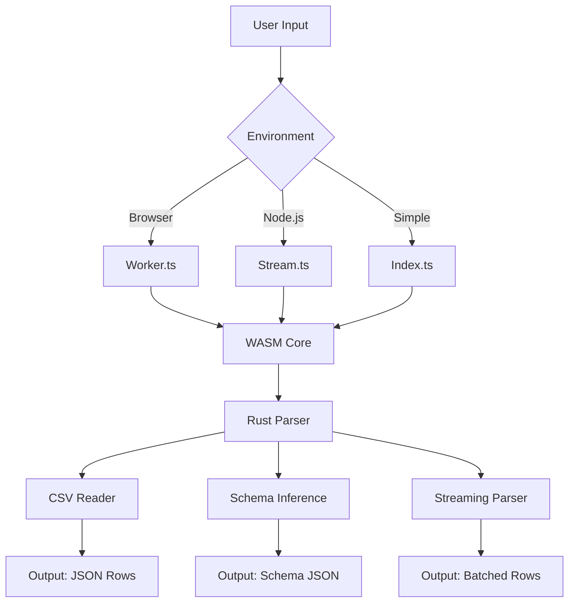

# Ultra-Fast CSV Parser (WASM-Backed) - Development Plan

## Project Overview
Build a high-performance CSV parsing library with Rust core compiled to WASM, TypeScript wrapper for browser/Node.js usage, supporting streaming, typed parsing, schema inference, and chunked processing.

## Architecture Diagram

## Detailed Implementation Plan

### Phase 1: Project Setup and Structure
- [ ] Create complete directory structure as specified
- [ ] Initialize package.json with dependencies (TypeScript, Rollup, testing frameworks)
- [ ] Set up basic README.md with project description

### Phase 2: Rust WASM Core Development
- [ ] Create wasm/Cargo.toml with required dependencies (csv, serde, wasm-bindgen)
- [ ] Implement core lib.rs with parse_csv function
- [ ] Implement StreamingParser struct with push_chunk and finish methods
- [ ] Implement infer_schema function with type detection logic
- [ ] Add comprehensive Rust unit tests for parsing edge cases
- [ ] Create build.sh script for WASM compilation
- [ ] Optimize WASM output size using wasm-opt

### Phase 3: TypeScript Wrapper Implementation
- [ ] Create src/types.ts with TypeScript interfaces and types
- [ ] Implement src/index.ts with simple parse functions and WASM initialization
- [ ] Implement src/stream.ts with async iterator for streaming parsing
- [ ] Implement src/worker.ts for browser Web Worker integration
- [ ] Add error handling and fallback mechanisms

### Phase 4: Build and Bundling Setup
- [ ] Configure rollup.config.js for ESM/CJS output with WASM support
- [ ] Set up npm scripts for build, test, and development
- [ ] Ensure proper WASM file inclusion in distribution

### Phase 5: Testing Infrastructure
- [ ] Create tests/ directory with Rust and JavaScript test suites
- [ ] Implement tests for basic parsing, streaming, schema inference
- [ ] Add stress tests for large files (100MB+) and memory leak detection
- [ ] Set up CI/CD pipeline for automated testing

### Phase 6: Demo and Documentation
- [ ] Create demo/ folder with browser playground
- [ ] Implement performance benchmarks comparing to PapaParse, fast-csv, d3-dsv
- [ ] Write comprehensive README.md with usage examples
- [ ] Add documentation for browser, Node.js, and Worker usage

### Phase 7: Optimization and Production Readiness
- [ ] Implement WASM caching strategies for browsers
- [ ] Add fallback JS parser for environments without WASM support
- [ ] Optimize memory usage and reduce allocations
- [ ] Final performance benchmarking and optimization

### Phase 8: Release Preparation
- [ ] Update package.json with final version and metadata
- [ ] Create changelog and release notes
- [ ] Test npm publish process
- [ ] Validate cross-platform compatibility

## Key Technical Decisions
- Use wasm-bindgen for JS/WASM interop
- JSON string serialization for fastest boundary crossing
- Batched processing to minimize JS↔WASM calls
- Async iterators for streaming API
- Web Workers for non-blocking browser parsing

## Success Criteria
- Parse 100MB CSV in <5 seconds
- Memory usage <2x file size during parsing
- Full compatibility with browser and Node.js environments
- Comprehensive test coverage (>90%)
- API similar to popular CSV libraries for easy adoption

## Risk Mitigation
- Implement JS fallback for WASM-unsupported environments
- Extensive testing of chunk boundaries and edge cases
- Memory profiling to prevent leaks
- Browser compatibility testing across major engines